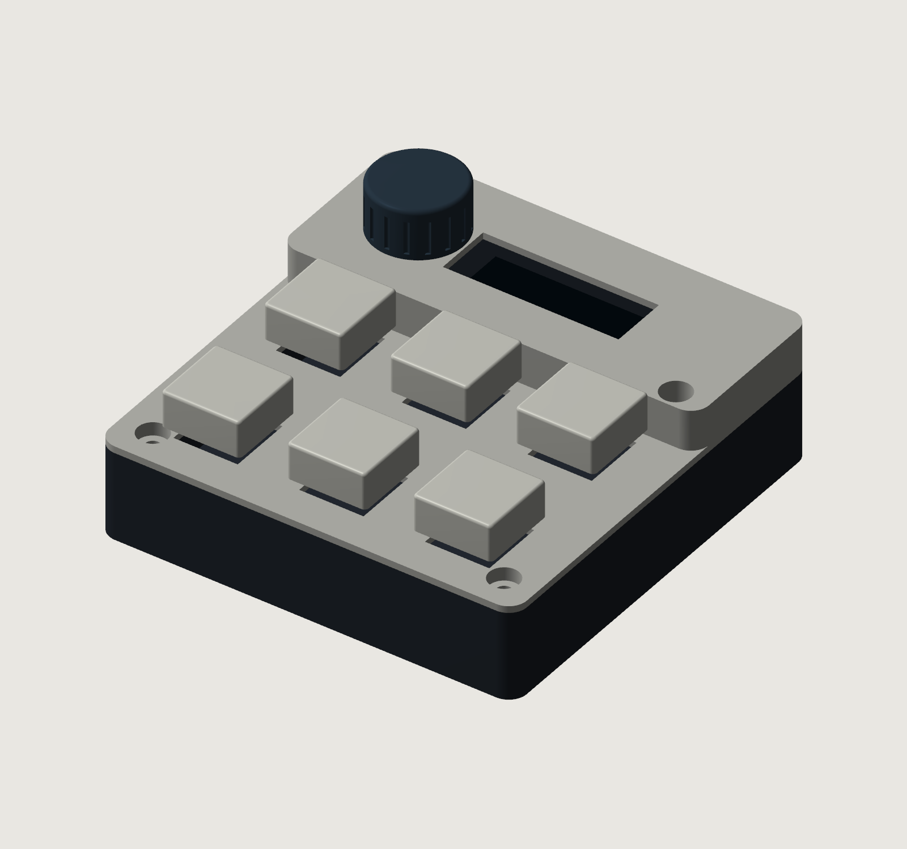
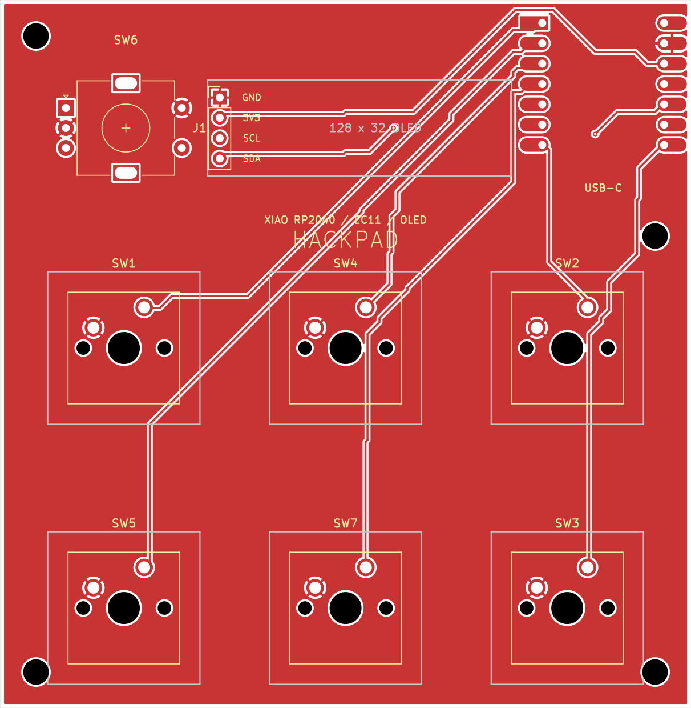

# Hackpad PCB — revision 1.0

Open **Hackpad.kicad_pro** in KiCad 10. The project includes its own symbol and footprint libraries; no care-package installation is needed. Original Desktop files were left unchanged.

CAD visualization, not a photograph of an assembled device.

This project was substantially generated and revised with ChatGPT/Codex assistance, following the owner's feature/layout choices and design review. See Software/Feature-status.md for unfinished integrations and Submission-status.md for funding status.

## What is finished

- 86.5 × 88.5 mm, two copper layers, 1.6 mm PCB.
- Six soldered MX switches in the established 3 × 2 layout.
- Clickable EC11 at top-left; 0.91-inch OLED immediately to its right.
- Seeed Studio XIAO RP2040 at top-right, USB-C facing the top edge.
- Routed signals, front/back ground pours, four 3.2 mm mounting holes.
- ERC, DRC and schematic parity reports included. All report zero issues.
- Gerber copper, masks, silkscreens, outline, and separate plated/non-plated drill files included.

The matching case is supplied in **Case/** as STEP and STL files, with an assembly guide and geometry checks. The native Fusion `Case/Hackpad_Case.f3d` includes editable base/cover features and a positioned knob. Case revision 1.1 corrects the CAD Y direction and knob placement; use the new case files, not earlier archives. Actual firmware and desktop-helper source are included in **Software/**; this is a development build, not a hardware-tested release. See **Software/Feature-status.md** for the exact remaining integration work.

## Pin map

View from above, USB-C at the top. Key numbers describe physical positions; existing SW references are preserved.

| Control | Reference / pad | XIAO label | RP2040 GPIO | Net |
|---|---|---|---|---|
| Top-left key | SW1 / 1 | D0 | 26 | KEY1 |
| Top-middle key | SW4 / 1 | D2 | 28 | KEY2 |
| Top-right key | SW2 / 1 | D6 | 0 | KEY3 |
| Bottom-left key | SW5 / 1 | D1 | 27 | KEY4 |
| Bottom-middle key | SW7 / 1 | D3 | 29 | KEY5 |
| Bottom-right key | SW3 / 1 | D7 | 1 | KEY6 |
| Encoder rotation A | SW6 / A | D10 | 3 | ENC_A |
| Encoder rotation B | SW6 / B | D9 | 4 | ENC_B |
| Encoder press / Enter | SW6 / S1 | D8 | 2 | ENC_CLICK |
| OLED data | J1 / 4 | D4 / SDA | 6 | OLED_SDA |
| OLED clock | J1 / 3 | D5 / SCL | 7 | OLED_SCL |
| OLED power | J1 / 2 | 3V3 | — | +3V3 |
| OLED ground | J1 / 1 | GND | — | GND |

All key pad 2 connections, encoder C, and encoder S2 connect to ground. Enable input pull-ups and software debounce for keys and encoder press. Use a quadrature decoder for rotation; configure its transitions-per-detent for the supplied encoder so one detent produces one menu step. Reverse direction in firmware if needed. Encoder press is independently wired and can mean Enter/select or another action by mode.

Six keys + three encoder inputs + two OLED signals use all 11 exposed GPIOs. Independent key wiring supports simultaneous presses without a switch matrix or diodes. Extra kit LEDs are not fitted in this design.

## Parts used from the published kit

| Quantity | Part |
|---:|---|
| 1 | Standard Seeed Studio XIAO RP2040, not RP2040 Plus |
| 6 | MX-style through-hole switches |
| 6 | 1u DSA keycaps |
| 1 | EC11 clickable rotary encoder |
| 1 | 0.91-inch 128 × 32 I²C OLED, GND–VCC–SCL–SDA |
| 1 | 4-pin 2.54 mm header supplied with/for OLED |
| 4 | M3 × 16 mm case screws, for planned enclosure |
| 4 | M3 heat-set inserts, for planned enclosure |

## Assembly assumptions

- The supplied encoder matches the Hackpad-style EC11 footprint: A/C/B terminals at 2.5 mm pitch, click terminals opposite, and two slotted metal anchors. Nominal shaft height is 20 mm. A knob is not listed in the published kit; a printable knob can be matched to the supplied shaft during case completion.
- OLED is mounted display-up and extends rightward from J1. **J1 pins run top-to-bottom: GND, 3V3, SCL, SDA.** The module envelope is assumed to be 38 × 12 mm; it is shown in the project footprint and drawing layer. Confirm the actual supplied module uses that header orientation before soldering.
- OLED is powered from 3.3 V. The common module includes I²C pull-ups; confirm that the supplied module has pull-ups to 3.3 V. Do not connect I²C pull-ups to 5 V. The MCU's weak internal pull-ups alone are not the design basis for a reliable I²C bus.
- XIAO uses the existing care-package hybrid footprint, with corrected RP2040 schematic pin names. Direct solder mounting is assumed for the planned case; tall sockets change the case fit.
- USB supplies the XIAO directly. Its 5 V breakout is deliberately unused. The circuit has no battery input.
- Switches are soldered, not hot-swap. The upper row was aligned to a common centre line; the original column spacing and lower row were preserved.
- EC11 switch anchor pads are mechanical only. They do not substitute for the C/S2 ground connections.

## Mechanical coordinates

Millimetres from PCB top-left; X right, Y down.

| Item | X | Y |
|---|---:|---:|
| Key column centres | 15.50 / 43.25 / 71.00 | — |
| Key row centres | — | 43.50 / 76.00 |
| Encoder shaft centre | 15.75 | 16.00 |
| OLED GND header pin | 27.50 | 12.19 |
| XIAO footprint centre | 75.50 | 10.50 |
| Mount H1 | 4.50 | 4.50 |
| Mount H2 | 82.00 | 29.50 |
| Mount H3 | 4.50 | 84.00 |
| Mount H4 | 82.00 | 84.00 |

The matching case uses a rounded base and removable stepped cover, four M3 screws and heat-set inserts. See **Case/Assembly-guide.md** for the assembly order, printing orientation and component fit assumptions.

## Manufacturing files

Use the Gerbers ZIP, including both drill files, for the PCB only. Board specification: two layers, FR-4, 1.6 mm thickness; design uses 0.25 mm traces, 0.20 mm minimum clearance, 0.60/0.30 mm vias, and 0.50 mm minimum copper-to-edge clearance. The Stardance design project has been created; no funding application or manufacturing order has been submitted. See Submission-status.md.

The checks validate the CAD files; this design has not been physically assembled or tested. The case has CAD checks but no physical print test; software has automated logic/display tests but still requires hardware and app integration testing.

## Sources

- [Hackpad / Stardance](https://hackpad.hackclub.com/)
- [Hack Club published kit contents](https://blueprint.hackclub.com/hackpad/parts)
- [Hackpad component guidance](https://hackpad.hackclub.com/add-components)
- [Seeed XIAO RP2040 pin map](https://wiki.seeedstudio.com/XIAO-RP2040/)

Footprints are derived from KiCad's installed libraries and the user's existing Hackpad care package. The XIAO's fabrication graphics were retained, and its courtyard added. The OLED header footprint was expanded to describe the full module envelope.
